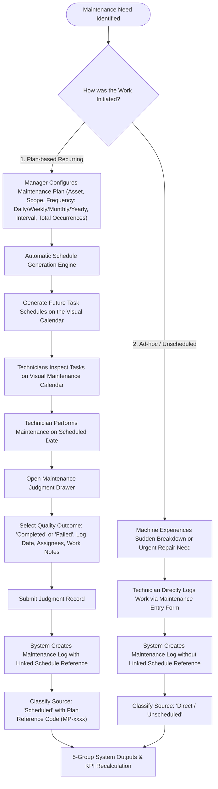
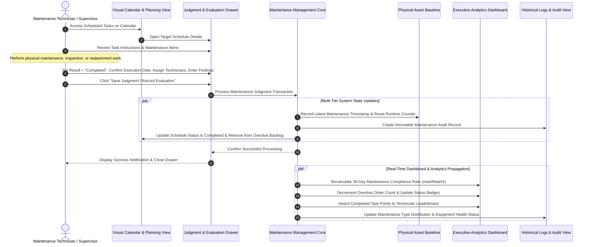

# EAMO Process Specification: Maintenance Planning, Judgment & Output Lifecycle

**Project Name:** EAMO (Enterprise Asset & Maintenance Operations Platform)  
**Module Name:** Maintenance Operations & Performance Governance  
**Target Routes:**  
- **Visual Calendar & Task Planning:** `http://localhost:5173/ops/maintenance-plans`  
- **Maintenance Logs & Analytics:** `http://localhost:5173/maintenance/maintenance-logs`  
- **Executive Analytics Dashboard:** `http://localhost:5173/dashboard/analytics`  

---

## 1. Executive Summary

The **Maintenance Planning, Judgment & Output Lifecycle** workflow defines how industrial assets are systematically maintained, evaluated, and tracked throughout their operational lifecycle in the EAMO platform. 

The system operates across two operational paths:
1. **Scheduled Maintenance:** Generated systematically using predefined recurrence frequencies to prevent equipment degradation.
2. **Direct / Unscheduled Maintenance:** Initiated dynamically by technicians on the factory floor in response to sudden equipment malfunctions or spontaneous servicing needs.

When maintenance work is submitted through the **Judgment** process, the system automatically evaluates the task status, generates immutable audit trails, updates machine operating baselines, and recalculates plant-wide Key Performance Indicators (KPIs) in real time.

---

## 2. Process Architecture & Workflows

### 2.1 High-Level Operational Process Flow



---

### 2.2 End-to-End Operational Sequence Diagram



---

## 3. Step-by-Step Business Process

### Step 1: Work Sourcing & Schedule Initiation

Organizations manage equipment reliability through two distinct maintenance channels:

#### A. Scheduled Maintenance (Planned Preventative)
* **Plan Configuration:** Maintenance supervisors establish formal plans by selecting the target machine, maintenance scope category (containing standard inspection items), recurrence cycle (`daily`, `weekly`, `monthly`, or `yearly`), cycle interval multiplier, and total occurrences.
* **Automated Calendar Generation:** The system automatically calculates calendar dates and populates forward-looking maintenance task slots across the plant calendar.
* **Task Visibility:** Tasks appear on technician schedules with clear indicators of due dates, standard procedures, and pre-assigned teams.

#### B. Direct / Unscheduled Maintenance (Reactive & Ad-hoc)
* **Spontaneous Occurrence:** Triggered when an operator reports a sudden breakdown, an abnormal noise, or when an on-site technician performs urgent adjustments outside of a planned schedule.
* **Direct Record Creation:** Technicians log the work directly through the maintenance entry screen without requiring an existing calendar slot.

---

### Step 2: On-Site Task Execution & Judgment Submission

1. **Task Review:** The technician opens the scheduled task via the Visual Calendar or mobile interface to review the required service points and safety guidelines.
2. **Work Execution:** Physical actions are performed on the asset (e.g. lubrication, belt tensioning, electrical checks, filter replacement).
3. **Judgment Evaluation:**
   * **Evaluation Outcome:** The technician marks the work item as **`Completed`** (or `Failed` if unresolved anomalies are found).
   * **Date Verification:** The system defaults to the current execution date while allowing verified past dates (future dates are prevented).
   * **Personnel Assignment:** The technician confirms all contributing team members.
   * **Observations & Notes:** Technical findings, replaced part numbers, and qualitative observations are recorded.
4. **Final Confirmation:** The user submits the judgment, locking the evaluation.

---

### Step 3: Comprehensive 5-Tier Business Outputs

Saving a Judgment evaluation automatically produces **five coordinated outputs across the entire operational platform**:

```
                              WHEN A JUDGMENT IS SAVED
                                         │
    ┌────────────────┬───────────────────┼───────────────────┬────────────────┐
    ▼                ▼                   ▼                   ▼                ▼
[Output 1]       [Output 2]          [Output 3]          [Output 4]       [Output 5]
Audit Log        Schedule State      Asset Baseline      Executive KPI    Historical Logs
Record Created   Synchronized        Reset               Recalculated     & Analytics
```

#### 📌 Output 1: Audit Log Record Creation
* An immutable historical log is stored containing the asset identifier, assigned technicians, exact execution date, judgment outcome (`Completed`), and detailed notes.
* This log provides traceable compliance proof for quality audits and regulatory standards (ISO 9001, IATF 16949).

#### 📌 Output 2: Schedule State Synchronization
* The calendar task date is updated to reflect the actual date of completion.
* The task transitions out of the **Pending** or **Overdue** queue and is marked as **Completed**.
* Contributing technicians are permanently associated with the completed schedule.

#### 📌 Output 3: Asset Operating Baseline Reset
* The asset's official *Last Maintenance* operational record is updated with the latest service timestamp, technician details, and service notes.
* **Operational Impact:** Resets the asset's accumulated operating runtime calculation, enabling accurate tracking of operating hours remaining before the next scheduled preventative service threshold.

#### 📌 Output 4: Executive Dashboard & KPI Recalculation
* **Maintenance Orders KPI Card:**
  * Completed task volume increases immediately.
  * Overdue order backlog decreases if a past-due item was resolved.
  * The 30-day Maintenance Compliance Rate recalculates dynamically:
    $$\text{Compliance Rate} = \left( \frac{\text{Completed Orders}}{\text{Total Scheduled Orders in 30 Days}} \right) \times 100\%$$
* **Workforce Performance Leaderboard:**
  * Contributing technicians receive credit for the completed maintenance order.
  * Leaderboard rankings and total output counts update in real time.

#### 📌 Output 5: Historical Logs & Analytics Refresh
* **Maintenance History Table:** Appends a new record categorized with **Source: `Scheduled`** along with its parent Plan Reference Code (e.g. `MP-001`), or **Source: `Direct / Unscheduled`** if logged ad-hoc.
* **Maintenance Type Distribution Chart:** Increases the relative slice for the performed maintenance type (with labels formatted in clean Sentence Case).
* **Equipment Warning Status Chart:** Reclassifies the asset from *Overdue* back to **Healthy** status.

---

## 4. Operational Sourcing Matrix

The table below outlines how maintenance sources are differentiated and displayed across the platform:

| Source Classification | Initiation Method | Plan Association | Business Context & Traceability |
| :--- | :--- | :--- | :--- |
| **Scheduled** *(Theo kế hoạch)* | Generated automatically from recurring plan cycles | Linked to parent Plan Code (e.g. `MP-2026-001`) | Routine preventative servicing executed according to planned manufacturing schedules. |
| **Direct / Unscheduled** *(Đột xuất / Trực tiếp)* | Logged manually on-demand at machine site | Independent (No plan association) | Unplanned emergency repairs, immediate adjustments, or ad-hoc component replacements. |

---

## 5. Maintenance Classification Categories

The platform standardizes maintenance into clear functional categories:

1. **Periodic Maintenance:** Routine, calendar-scheduled inspections and preventative care (e.g., weekly lubrication, monthly calibration).
2. **Corrective Maintenance:** Restorative servicing performed to rectify detected faults or operational anomalies.
3. **Preventative Maintenance:** Proactive component replacements based on operating hours or wear thresholds prior to failure.
4. **Technical Inspection:** Diagnostic evaluations, parameter measurement checks, and safety audits.
5. **Emergency Maintenance:** Immediate high-priority interventions following unplanned machine stoppages.
6. **Unspecified / Other:** Custom specialized maintenance procedures.

---

## 6. Executive Governance & Quality Compliance

By closing the loop between scheduling, on-site judgment, asset baselines, and executive KPIs, the EAMO maintenance workflow ensures:
* **Zero Lost Work:** Every completed task immediately updates asset telemetry and operational dashboards.
* **Transparent Accountability:** Every maintenance event records the executing technician and supervisor judgment.
* **Auditable Integrity:** Historical records remain unalterable and clearly distinguish between scheduled adherence and reactive breakdown rates.
