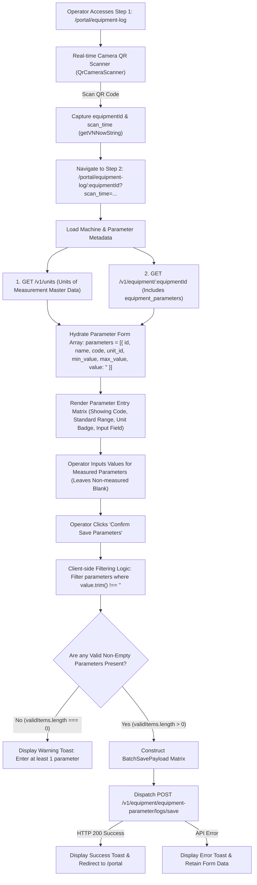
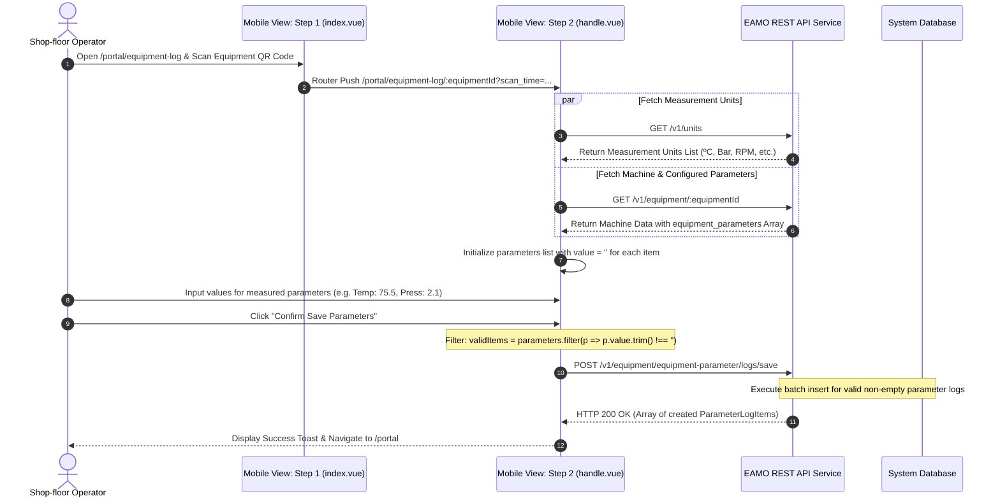

# EAMO Technical Specification: Equipment Parameter Logging Workflow

**Project Name:** EAMO (Enterprise Asset & Maintenance Operations Platform)  
**Module Name:** Operator Interface (OI) - Mobile Portal Equipment Parameter Logging  
**Routes:**  
- Step 1 (Scanner): `http://localhost:5173/portal/equipment-log`  
- Step 2 (Parameter Matrix Form): `http://localhost:5173/portal/equipment-log/:equipmentId`  
**Target View Components:**  
- [`src/views/mobile/portal/equipment-log/index.vue`](file:///c:/Users/khanh/Projects/eamo/frontend/src/views/mobile/portal/equipment-log/index.vue)  
- [`src/views/mobile/portal/equipment-log/handle.vue`](file:///c:/Users/khanh/Projects/eamo/frontend/src/views/mobile/portal/equipment-log/handle.vue)

---

## 1. Executive Summary

The **Equipment Parameter Logging** workflow in the EAMO Mobile Operator Interface (OI) empowers shop-floor operators to record operational telemetry (e.g. Temperature, Pressure, Vibration, RPM) directly at the physical machine. Following a 2-step QR scan workflow, operators are presented with a dynamic input list of all parameters configured for that specific equipment. **Crucially, any un-entered or blank parameter fields are automatically excluded from the batch persistence payload, saving system storage and preventing empty records**.

---

## 2. Architecture & System Flowchart

### 2.1 High-Level Operational Flowchart



### 2.2 End-to-End Sequence Diagram



---

## 3. Detailed Step-by-Step Technical Execution

### Step 1: Scanner Route (`/portal/equipment-log`)
- **QR Scanning**: Uses `QrCameraScanner` to scan physical equipment labels.
- **Timestamp Capture**: Stores exact local timestamp (`getVNNowString()`).
- **Navigation**: Redirects to Step 2 with `:equipmentId` route parameter and `scan_time` query string.

### Step 2: Parameter Matrix Entry Route (`/portal/equipment-log/:equipmentId`)
- **Metadata Hydration (`loadData`)**:
  - Fetches measurement units via `GET /v1/units` (e.g., ºC, Bar, RPM, Hz).
  - Fetches machine metadata and its specific configured parameters array (`equipment_parameters`) via `GET /v1/equipment/:equipmentId`.
  - Initializes each parameter reactive model with `value: ''`.
- **Dynamic Parameter Matrix UI**:
  - Renders parameter name and code tag.
  - Formats standard min/max thresholds (`formatRangeText`).
  - Displays unit badge (`getUnitName`).
  - Provides clean input field for telemetry entry.
- **Client-Side Non-Empty Filtering (`handleSubmit`)**:
  ```ts
  const validItems = parameters.value.filter(
    (p) => p.value !== undefined && p.value !== null && String(p.value).trim() !== ''
  );
  ```
  - If `validItems.length === 0`, execution halts with a warning message.
  - Constructs `BatchSavePayload` containing **only** valid items.
  - Executes batch save API call `POST /v1/equipment/equipment-parameter/logs/save`.

---

## 4. API Specification

### Endpoint: Batch Save Equipment Parameter Logs
- **HTTP Method**: `POST`
- **URL Path**: `${API_BASE_URL}/v1/equipment/equipment-parameter/logs/save`
- **Authentication**: `Authorization: Bearer <accessToken>`

#### Request Payload Schema
```json
{
  "equipment_id": "018e4b3c-9a1d-7212-a123-456789abcdef",
  "recorded_at": "2026-08-05 11:45:00",
  "parameters": [
    {
      "equipment_parameter_id": "018e4b3c-9b2e-7323-b234-567890bcdef1",
      "unit_id": "018e4b3c-9c3f-7434-c345-678901cdef23",
      "value": "75.5",
      "recorded_at": "2026-08-05 11:45:00"
    },
    {
      "equipment_parameter_id": "018e4b3c-9b2e-7323-b234-567890bcdef2",
      "unit_id": "018e4b3c-9c3f-7434-c345-678901cdef24",
      "value": "2.1",
      "recorded_at": "2026-08-05 11:45:00"
    }
  ]
}
```

#### Response Schema (HTTP 200 OK)
```json
{
  "status": "success",
  "message": "Batch parameter logs saved successfully",
  "data": [
    {
      "id": "018e4b3c-9d4a-7545-d456-789012def345",
      "equipment_id": "018e4b3c-9a1d-7212-a123-456789abcdef",
      "equipment_parameter_id": "018e4b3c-9b2e-7323-b234-567890bcdef1",
      "unit_id": "018e4b3c-9c3f-7434-c345-678901cdef23",
      "value": "75.5",
      "recorded_at": "2026-08-05 11:45:00",
      "created_at": "2026-08-05T11:45:01Z"
    },
    {
      "id": "018e4b3c-9d4a-7545-d456-789012def346",
      "equipment_id": "018e4b3c-9a1d-7212-a123-456789abcdef",
      "equipment_parameter_id": "018e4b3c-9b2e-7323-b234-567890bcdef2",
      "unit_id": "018e4b3c-9c3f-7434-c345-678901cdef24",
      "value": "2.1",
      "recorded_at": "2026-08-05 11:45:00",
      "created_at": "2026-08-05T11:45:01Z"
    }
  ]
}
```
