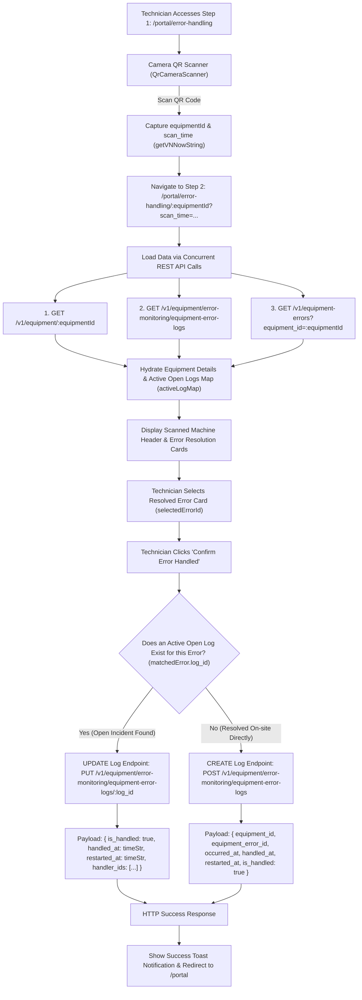
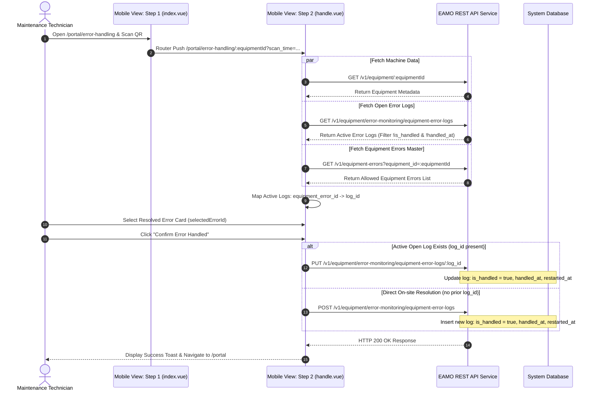

# EAMO Technical Specification: Equipment Error Handling & Resolution Workflow

**Project Name:** EAMO (Enterprise Asset & Maintenance Operations Platform)  
**Module Name:** Operator Interface (OI) - Mobile Portal Equipment Error Handling  
**Routes:**  
- Step 1 (Scanner): `http://localhost:5173/portal/error-handling`  
- Step 2 (Resolution Form): `http://localhost:5173/portal/error-handling/:equipmentId`  
**Target View Components:**  
- [`src/views/mobile/portal/error-handling/index.vue`](file:///c:/Users/khanh/Projects/eamo/frontend/src/views/mobile/portal/error-handling/index.vue)  
- [`src/views/mobile/portal/error-handling/handle.vue`](file:///c:/Users/khanh/Projects/eamo/frontend/src/views/mobile/portal/error-handling/handle.vue)

---

## 1. Executive Summary

The **Equipment Error Handling** workflow enables maintenance technicians and shop-floor engineers to resolve active machine breakdowns. By scanning an equipment QR code, the system cross-references active open error logs against configured machine errors. Technicians select the resolved issue, and the system either updates the existing active incident log to `is_handled: true` or records a new completed resolution log.

---

## 2. Architecture & System Flowchart

### 2.1 High-Level Operational Flowchart



### 2.2 End-to-End Sequence Diagram



---

## 3. Detailed Step-by-Step Technical Execution

### Step 1: Scanner Route (`/portal/error-handling`)
- **QR Code Scanning**: Utilizes `QrCameraScanner` component to scan machine barcode/QR tag.
- **Timestamp Binding**: Obtains timestamp of resolution start using `getVNNowString()`.
- **Navigation**: Navigates to Step 2 with URL parameter `:equipmentId` and query `scan_time`.

### Step 2: Resolution Route (`/portal/error-handling/:equipmentId`)
- **Data Hydration**: On component mount (`onMounted`):
  1. Fetches machine details via `GET /v1/equipment/:equipmentId`.
  2. Queries active open logs (`GET /v1/equipment/error-monitoring/equipment-error-logs`) and filters unresolved logs (`!handled_at && !is_handled && !deleted_at`). Builds `activeLogMap` mapping `equipment_error_id` ➔ `log_id`.
  3. Loads error categories specific to this machine via `GET /v1/equipment-errors`.
- **Single-Choice Card Selection**: Renders errors as selectable cards (`filteredMasterErrors`).
- **Resolution Execution (`handleSubmit`)**:
  - Validates `selectedErrorId`.
  - Determines resolution strategy:
    - **Existing Log Resolution**: Executes `PUT` request to update existing `log_id` setting `is_handled = true`, `handled_at`, `restarted_at`, and `handler_ids`.
    - **Immediate Log Creation**: Executes `POST` request creating a new resolved error log entry.
  - Redirects to `/portal` upon completion.

---

## 4. API Specifications

### Endpoint A: Update Existing Error Log (Resolve Incident)
- **HTTP Method**: `PUT`
- **URL Path**: `${API_BASE_URL}/v1/equipment/error-monitoring/equipment-error-logs/{log_id}`
- **Authentication**: `Authorization: Bearer <accessToken>`

#### Request Payload Schema
```json
{
  "handled_at": "2026-08-05 11:45:00",
  "restarted_at": "2026-08-05 11:45:00",
  "is_handled": true,
  "notes": "Bearing Alignment & Lubrication Done",
  "handler_ids": ["018e4b3c-0000-7000-a000-000000000001"]
}
```

### Endpoint B: Create Resolved Error Log (Direct On-site Resolution)
- **HTTP Method**: `POST`
- **URL Path**: `${API_BASE_URL}/v1/equipment/error-monitoring/equipment-error-logs`
- **Authentication**: `Authorization: Bearer <accessToken>`

#### Request Payload Schema
```json
{
  "equipment_id": "018e4b3c-9a1d-7212-a123-456789abcdef",
  "equipment_error_id": "018e4b3c-9b2e-7323-b234-567890bcdef1",
  "occurred_at": "2026-08-05 11:45:00",
  "handled_at": "2026-08-05 11:45:00",
  "restarted_at": "2026-08-05 11:45:00",
  "is_handled": true,
  "notes": "Bearing Alignment & Lubrication Done",
  "handler_ids": ["018e4b3c-0000-7000-a000-000000000001"]
}
```
