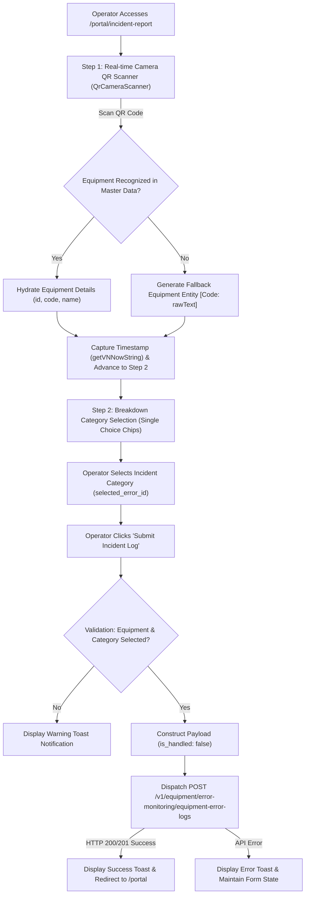
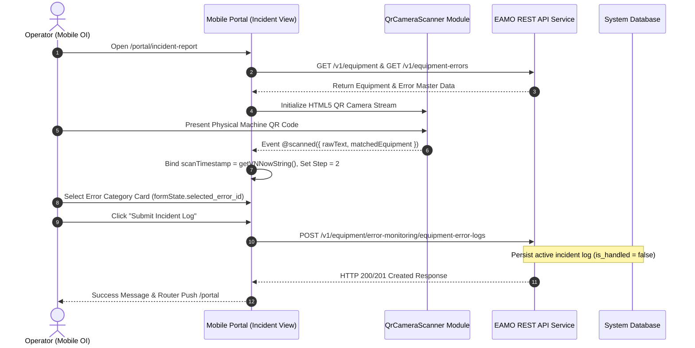

# EAMO Technical Specification: Incident Reporting Workflow

**Project Name:** EAMO (Enterprise Asset & Maintenance Operations Platform)  
**Module Name:** Operator Interface (OI) - Mobile Portal Incident Reporting  
**Route:** `http://localhost:5173/portal/incident-report`  
**Target View Component:** [`src/views/mobile/portal/incident-report/index.vue`](file:///c:/Users/khanh/Projects/eamo/frontend/src/views/mobile/portal/incident-report/index.vue)

---

## 1. Executive Summary

The **Incident Reporting** workflow in the EAMO Mobile Operator Interface (OI) is designed for shop-floor operators to immediately log operational breakdowns, mechanical failures, or unexpected machine stops. Utilizing a 2-step mobile-first wizard, operators scan an equipment QR code, select a pre-configured breakdown category, and record an active incident log in real-time.

---

## 2. Architecture & System Flowchart

### 2.1 High-Level Operational Flowchart



### 2.2 End-to-End Sequence Diagram



---

## 3. Detailed Step-by-Step Technical Execution

### Step 1: Identification & QR Camera Scanning
- **Camera Initialization**: Loads `QrCameraScanner` leveraging HTML5 QR code scanning engine.
- **Master Data Preloading**: On mount (`onMounted`), issues concurrent GET requests to fetch master equipment lists and error types (`/v1/equipment` and `/v1/equipment-errors`).
- **QR Code Recognition**: When a QR code is detected:
  - Matches scanned string against preloaded `equipments` by `id` or `code`.
  - Fallback logic generates a dynamic equipment placeholder if unknown.
  - Captures exact local timestamp via `getVNNowString()`.
  - Automatically transitions state from `step = 1` to `step = 2`.

### Step 2: Breakdown Information & Form Submission
- **Single-Choice Card Matrix**: Displays error categories as interactive chip cards (`filteredMasterErrors`).
- **Live Search Filter**: Offers search capability when master error list exceeds 4 items.
- **Form State Binding**: Binds selected error ID (`formState.selected_error_id`).
- **Submit Handling (`handleSubmit`)**:
  - Validates selected equipment and error category.
  - Constructs `payload` with `is_handled: false` to represent an unresolved open incident.
  - Dispatches `POST` request to the error monitoring backend service.

---

## 4. API Specification

### Endpoint: Create Equipment Error Log
- **HTTP Method**: `POST`
- **URL Path**: `${API_BASE_URL}/v1/equipment/error-monitoring/equipment-error-logs`
- **Authentication**: `Authorization: Bearer <accessToken>`

#### Request Payload Schema
```json
{
  "equipment_id": "018e4b3c-9a1d-7212-a123-456789abcdef",
  "equipment_error_id": "018e4b3c-9b2e-7323-b234-567890bcdef1",
  "occurred_at": "2026-08-05 11:45:00",
  "is_handled": false,
  "notes": "Motor Overheating / High Temperature",
  "handler_ids": ["018e4b3c-0000-7000-a000-000000000001"]
}
```

#### Response Schema (HTTP 201 Created)
```json
{
  "status": "success",
  "message": "Equipment error log created successfully",
  "data": {
    "id": "018e4b3c-9c3f-7434-c345-678901cdef23",
    "equipment_id": "018e4b3c-9a1d-7212-a123-456789abcdef",
    "equipment_error_id": "018e4b3c-9b2e-7323-b234-567890bcdef1",
    "occurred_at": "2026-08-05 11:45:00",
    "handled_at": null,
    "is_handled": false,
    "notes": "Motor Overheating / High Temperature",
    "created_at": "2026-08-05T11:45:01Z"
  }
}
```
