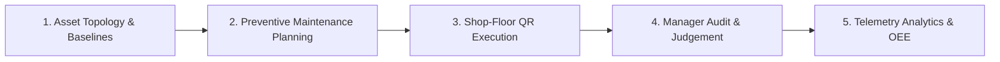

# EAMO — Equipment Asset Management Solution

<div align="center">


**Enterprise-Grade Industrial Asset Management & Maintenance Operations System**

<br/>


</div>

---

## Executive Overview

In contemporary manufacturing plants, production complexes, and high-throughput industrial workshops, physical equipment represents both the primary engine of enterprise revenue and the single largest vulnerability to operational continuity. Traditional maintenance practices have long suffered from fragmented operational realities: paper-based inspection clipboards that disappear into filing cabinets, disparate spreadsheets that fail to communicate across shifts, delayed reporting of micro-breakdowns that spiral into catastrophic downtime, and an absence of verifiable telemetry required for predictive reliability engineering.

**EAMO (Equipment Asset Management Solution)** was engineered to resolve this fundamental disconnect. As a comprehensive, enterprise-grade industrial asset management and Computerized Maintenance Management System (CMMS), EAMO establishes a centralized digital nervous system connecting plant machinery, shop-floor operators, reliability engineers, and executive management. The platform digitizes every phase of the machinery lifecycle—transforming raw, disconnected shop-floor observations into structured, audit-ready operational intelligence. By marrying rigorous asset hierarchy governance with high-speed, camera-native mobile execution, EAMO eliminates operational friction, enforces preventive discipline, and drives continuous improvement across overall equipment effectiveness (OEE).


---

## Operational Architecture: The Dual-Portal Paradigm

Industrial environments impose vastly different physical and cognitive demands depending on the user's operational role. A reliability engineer planning a quarterly plant overhaul requires multi-dimensional analytics, historical degradation trendlines, and granular schedule manipulation on high-resolution displays. Conversely, a frontline technician inspecting a high-pressure hydraulic press amidst machine vibration, ambient noise, and industrial protective gear requires instantaneous machine identification, high-contrast touch targets, and streamlined input workflows.

To serve these distinct operational contexts without compromise, EAMO is built upon a **Dual-Portal Operational Architecture**:

```
                               ┌────────────────────────────────────────────────────────┐
                               │             EAMO CENTRAL CLOUD / ON-PREMISE            │
                               │          Laravel 13 REST API & PostgreSQL Engine       │
                               └───────────────────────────┬────────────────────────────┘
                                                           │
                            ┌──────────────────────────────┴──────────────────────────────┐
                            ▼                                                             ▼
┌──────────────────────────────────────────────────────┐   ┌──────────────────────────────────────────────────────┐
│            DESKTOP WEB MANAGEMENT CONSOLE            │   │             MOBILE OPERATOR INTERFACE (OI)           │
│   (For Reliability Engineers, Planners & Admins)     │   │      (For Shop-Floor Technicians & Line Operators)   │
├──────────────────────────────────────────────────────┤   ├──────────────────────────────────────────────────────┤
│ • Interactive Multi-Tier Asset Topology Visualizer   │   │ • Camera-Native QR Machine Identification            │
│ • Unified Workspace Calendar & Recurrence Engine     │   │ • Interactive Step-by-Step Inspection Checklists     │
│ • Supervisory Judgment Drawer & Operational Release  │   │ • Immediate Incident Escalation & Photo Attachment   │
│ • Analytical Telemetry Trends & OEE Metric Modeling  │   │ • Rapid Analog Telemetry & Running Hour Capture      │
│ • Dynamic Role-Based Access Control (RBAC) Matrix    │   │ • Touch-Optimized Ergonomics & Field Validation      │
└──────────────────────────────────────────────────────┘   └──────────────────────────────────────────────────────┘
```

### 1. Desktop Web Management Console
The Management Console functions as the strategic command center for plant leadership, maintenance managers, and reliability engineers. Powered by Vue 3 and Ant Design, this portal provides complete visibility over plant taxonomy, preventive scheduling algorithms, compliance auditing, and time-series telemetry analytics. Decision-makers can visualize machine health distributions, analyze recurring failure patterns, rebalance technician assignments, and review detailed historical audits from any modern web browser.

### 2. Mobile Operator Interface (OI)
The Mobile Operator Interface is a touch-first, responsive web application purpose-built for the rugged reality of the factory floor. Optimized for smartphones, ruggedized industrial tablets, and handheld barcode terminals, the OI strips away administrative complexity. Technicians are never forced to navigate complex nested menus; scanning a physical QR code affixed to a machine instantly hydrates the relevant digital workspace, presenting pending checklists, telemetry logging inputs, and incident reporting forms in a single, focused view.

<table align="center">
  <tr>
    <td align="center" valign="top" width="33.3%">
      
      <br/><br/>
      <b>Camera QR Scanner</b><br/>
      <sub>Instant machine binding via physical QR badge</sub>
    </td>
    <td align="center" valign="top" width="33.3%">
      
      <br/><br/>
      <b>Notifications & Alerts</b><br/>
      <sub>Real-time machine breakdown & dispatch alerts</sub>
    </td>
    <td align="center" valign="top" width="33.3%">
      
      <br/><br/>
      <b>Inspection & Maintenance</b><br/>
      <sub>Live checklist execution and condition reporting</sub>
    </td>
  </tr>
</table>

---

## The 5-Stage Asset Operations Lifecycle

EAMO structures all plant maintenance activities around a closed-loop operational lifecycle, ensuring that every physical intervention is planned with precision, executed with verification, audited by leadership, and ingested into long-term reliability algorithms.



### Stage 1: Hierarchical Asset Topology & Operating Baselines
Effective asset management requires an accurate, unambiguous representation of the physical manufacturing environment. EAMO structures the factory floor through a strict five-tier parent-child taxonomy:
$$\text{Plant Area} \longrightarrow \text{Production Line} \longrightarrow \text{Machine Cell} \longrightarrow \text{Sub-Assembly} \longrightarrow \text{Component}$$

Within this structural framework, reliability engineers establish baseline operating specifications for every asset. Parameters such as operating temperature, hydraulic pressure, vibration velocity, current draw, and rotational speed are cataloged alongside their engineering units (`°C`, `bar`, `kW`, `RPM`), target operating values, and critical upper/lower boundary thresholds. Concurrently, the system generates dedicated cryptographic QR identifiers that physically bridge digital master records directly to the physical equipment tags on the production floor.

### Stage 2: Dual-Track Maintenance Planning & Scheduling
Unplanned breakdowns incur exponentially higher costs than planned servicing. EAMO manages this balance through a coordinated dual-track operational framework:
* **Track 1: Scheduled Preventative Maintenance**: Automated, calendar-driven cycles configured according to fixed operational intervals (daily rounds, weekly greasing, monthly sensor calibrations, and quarterly overhauls). The recurrence engine forecasts future workload requirements, assigns qualified engineering personnel, and orchestrates tasks across the interactive **Workspace Calendar** to prevent scheduling conflicts with production runs.
* **Track 2: Direct / Unscheduled Breakdown Intervention**: High-priority reactive workflows initiated directly on the shop floor when sudden mechanical anomalies occur. These work orders bypass forward planning, alerting on-duty technicians for rapid triage while retaining complete chronological traceability for post-incident root cause analysis.

### Stage 3: Shop-Floor QR Inspection & Checklist Execution
Technicians navigate their daily inspection rounds using the Mobile Operator Interface. Arriving at an asset, the technician scans the machine's QR code using their device's native camera stream. This physical interaction verifies presence at the machine and immediately surfaces the designated inspection checklist.

Checklist items accommodate diverse operational checks: binary pass/fail determinations, multi-state condition selectors, qualitative observations, and analog gauge measurements. EAMO applies intelligent client-side validation that filters out empty or un-entered parameters, ensuring that only genuine physical measurements enter the telemetry database. When an abnormal condition is detected, technicians can raise an immediate breakdown ticket, attaching photographic evidence captured directly from the camera and tagging standardized error classifications for rapid dispatch.

### Stage 4: Supervisory Evaluation & Operational Clearance (Judgment)
A cornerstone of EAMO's quality governance is the principle that maintenance execution is incomplete until formally audited and judged. Once a technician submits a checklist or maintenance task, the record enters the centralized **Review & Judgment Drawer**.

Plant managers, shift supervisors, and reliability engineers inspect recorded telemetry against established tolerance thresholds, review attached photographic proof, and evaluate technician commentary. The supervisor then renders a definitive operational judgment: granting official clearance to return the machine to production, or rejecting the submission and commissioning immediate corrective intervention. This supervisory gate guarantees audit readiness and ensures that substandard maintenance is identified and resolved before equipment is released back into service.

### Stage 5: Time-Series Telemetry & Reliability Analytics
Operational data captured during field inspections and maintenance routines feeds directly into EAMO's analytical processing engine. By synthesizing run hours, idle periods, and unplanned stoppage durations against time-series telemetry, the system calculates core industrial reliability indices:
* **Availability Factor ($A$):** The ratio of actual operational uptime against planned production availability.
* **Mean Time Between Failures (MTBF):** The statistical mean operating duration between intrinsic mechanical or electrical failures.
* **Mean Time To Repair (MTTR):** The average duration required for technical teams to diagnose, rectify, and restore an inoperative asset to production-ready status.
* **30-Day Compliance Rate:** The proportion of scheduled preventive maintenance tasks executed and approved within their designated execution windows.

---

## The 5-Tier Judgment Output Ecosystem

Submitting a supervisory judgment is not simply a status update; it triggers an atomic, multi-layered data synchronization across five critical operational domains within the enterprise:

```
                            [SUPERVISORY JUDGMENT EVENT]
                                          │
    ┌──────────────────┬──────────────────┼──────────────────┬──────────────────┐
    ▼                  ▼                  ▼                  ▼                  ▼
[Tier 1: Audit Log]  [Tier 2: Schedule] [Tier 3: Baseline] [Tier 4: Dashboard] [Tier 5: Health]
Immutable history    State updated,     Accumulated hours  30-day compliance  Machine status
with technician &    backlog cleared,   reset, cycle       recalculated,      re-evaluated to
timestamp proof      task closed        recalibrated       points awarded     Healthy state
```

1. **Tier 1: Permanent Historical Audit Trail**: Generates an immutable historical audit record capturing the asset identity, assigned technician, approving supervisor, completion timestamps, judgment result (`Completed` or `Failed`), and supervisory remarks for full compliance with ISO quality and industrial safety audits.
2. **Tier 2: Schedule State Synchronization**: Automatically transitions work orders on the central operational calendar from pending or overdue states to completed, clearing supervisory backlogs and updating shift status indicators in real time.
3. **Tier 3: Asset Operating Baseline Reset**: Updates the physical machine's operational lifecycle metrics, resetting accumulated running hour counters to establish an accurate baseline for subsequent preventive maintenance cycles.
4. **Tier 4: Executive Performance & KPI Recalculation**: Immediately triggers recalculation of plant-wide 30-day compliance metrics, decrements active overdue counters, and credits completed maintenance points to technician profiles on the operational leaderboard.
5. **Tier 5: Operational Health & Risk Classification Refresh**: Re-evaluates machine operating parameters against boundary conditions, automatically transitioning recovered assets from degraded or warning status back into the active `Healthy` category.


---

## Enterprise Governance & Dynamic Access Control (RBAC)

Industrial operations require a careful balance between robust security boundaries and pragmatic shop-floor usability. EAMO achieves this through a **Dynamic Permission Matrix & Policy Auto-Discovery System** enforced at both the HTTP request and application policy layers.

```
                              ORGANIZATIONAL ROLE HIERARCHY
                                             ▲
                                             │
                        ┌────────────────────┴────────────────────┐
                        │              ADMINISTRATOR              │
                        │    (Unrestricted Global System Power)   │
                        └────────────────────┬────────────────────┘
                                             │
                        ┌────────────────────┴────────────────────┐
                        │             PLANT MANAGER               │
                        │  (Org Admin & Operational Governance)   │
                        └────────────────────┬────────────────────┘
                                             │
                        ┌────────────────────┴────────────────────┐
                        │          MAINTENANCE ENGINEER           │
                        │    (Technical Master Data & Schedules)  │
                        └────────────────────┬────────────────────┘
                                             │
                        ┌────────────────────┴────────────────────┐
                        │          OPERATOR / SHOP USER           │
                        │    (Field Execution & Telemetry Logs)   │
                        └────────────────────┬────────────────────┘
                                             │
                        ┌────────────────────┴────────────────────┐
                        │            GUEST / AUDITOR              │
                        │       (Strictly Read-Only Access)       │
                        └─────────────────────────────────────────┘
```

### Security & Governance Architecture
* **Strict Role Boundaries**: Administrators hold complete platform access through global gate interceptors (`Gate::before`). Plant Managers oversee organizational structures, departments, and personnel allocations. Maintenance Engineers manage technical configurations, checklists, and preventative plans while remaining strictly prohibited from altering organizational user accounts. Shop Operators are limited to mobile execution and telemetry logging, while Guests retain read-only visibility without any data mutation permissions.
* **5 Standardized Capability Groups**: Dynamic permissions can be adjusted per user across five functional categories: *Organization Management*, *Equipment Master Data*, *Checklist Operations*, *Maintenance Management*, and *Telemetry & Monitoring*.
* **Zero-Configuration Policy Auto-Discovery**: Backend authorization utilizes automated namespace reflection to map domain models directly to their corresponding policy classes, maintaining consistent, audit-proof access enforcement without fragile manual route registrations.


---

## Technology Stack & Engineering Foundation

EAMO is engineered using modern web technologies selected for high concurrency, type safety, low latency, and operational durability.

| Architectural Layer | Core Technologies | Engineering Purpose & Implementation Highlights |
| :--- | :--- | :--- |
| **Backend Engine** | **PHP 8.4** &bull; **Laravel 13.x** | Modern object-oriented architecture leveraging strict typing, constructor property promotion, enums, robust Eloquent ORM mappings, and database transactions for operational safety. |
| **API & Authentication** | **OAuth 2.0 PKCE** &bull; **Laravel Passport** | Cryptographically secure token exchange for decoupled frontend clients, supporting refresh token rotation and granular permission scopes. |
| **Database Layer** | **PostgreSQL 16** | Relational data persistence optimized for JSON payload handling, recursive hierarchical queries, and time-series telemetry indexing. |
| **Frontend Architecture** | **Vue 3** &bull; **TypeScript 5.x** &bull; **Vite** | Modern reactive user interfaces utilizing the Composition API (`<script setup>`), strong static typing across all data transfer objects, and near-instantaneous HMR compilation. |
| **Component System** | **Ant Design Vue 4.x** &bull; **Tailwind CSS** | Comprehensive enterprise UI toolkit delivering sophisticated data tables, interactive modals, and date-range pickers, styled with ergonomic utility classes. |
| **Shop-Floor Hardware** | **HTML5 MediaDevices API** | Browser-native camera stream integration for sub-second optical QR code scanning, fully functional across mobile browsers without native application installation. |
| **Containerization** | **Docker** &bull; **Docker Compose** | Multi-container deployment orchestrating PHP-FPM, Nginx, PostgreSQL, and Node build environments for seamless local development and production parity. |

---

## Live Production Deployment

The EAMO platform is actively deployed and accessible for live demonstration and industrial operations:

* **Production URL**: [**https://eamo.io.vn**](https://eamo.io.vn/)
* **Demonstration Access**: Available upon verified organizational request.

---

## License & Support

This project is licensed under the [MIT License](LICENSE).

For technical inquiries, enterprise deployment consulting, or custom industrial integrations, please contact:

* **Official Website**: [https://eamo.io.vn](https://eamo.io.vn)
* **Lead Maintainer**: [khanhnd05@gmail.com](mailto:khanhnd05@gmail.com)

---

<div align="center">
  <small>&copy; 2026 EAMO. Equipment Asset Management Solution. Engineered for industrial reliability.</small>
</div>

