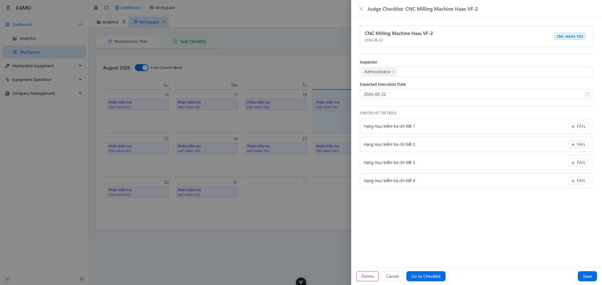
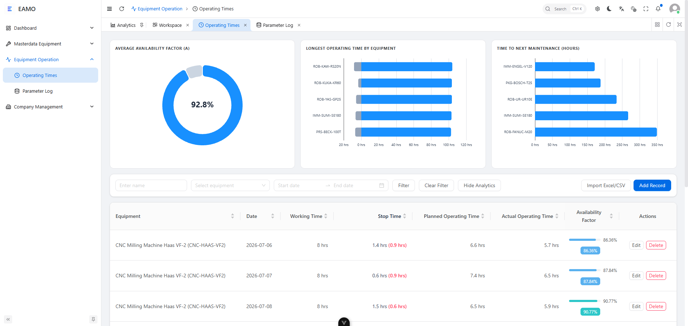
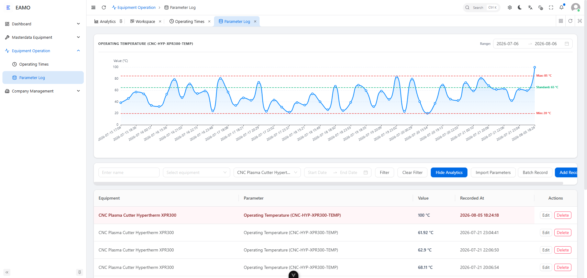
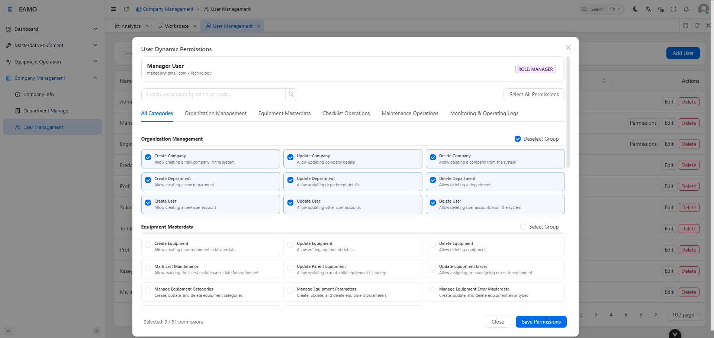
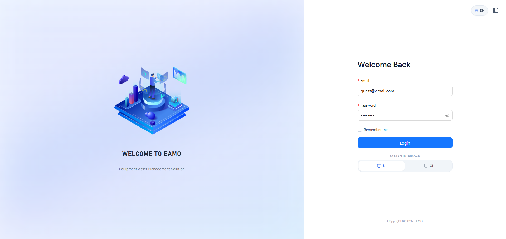

# EAMO — Equipment Asset Management Solution

**Enterprise-grade Industrial Asset Management & Maintenance Operations System**

[Overview](#overview) • [Desktop Management Console](#desktop-web-management-console) • [Mobile Operator Interface](#mobile-operator-interface-oi) • [Core Modules](#core-modules) • [Dynamic RBAC](#role-based-access-control--dynamic-permissions) • [Tech Stack](#system-architecture--technology-stack)

---

## Overview

**EAMO (Equipment Asset Management Solution)** is an enterprise-grade industrial asset management and maintenance operations platform built for modern manufacturing plants, production facilities, and industrial workshops.

The platform provides end-to-end lifecycle management across all plant equipment: from visual hierarchical topology mapping and daily checklist inspection routines to preventive maintenance scheduling, real-time operating parameter telemetry logging, and live machine breakdown incident tracking.

The system is composed of two primary interfaces:
1. **Desktop Web Management Console**: A full-featured operational and analytics dashboard designed for plant managers, maintenance leads, and reliability engineers.
2. **Mobile Operator Interface (OI)**: A camera-native, touch-optimized web application purpose-built for shop-floor technicians operating handheld devices and industrial tablets directly at machine stations.

---

## System User Interfaces

### Desktop Web Management Console

The desktop portal delivers high-level operational intelligence, visual asset topology mapping, maintenance calendars, telemetry graphs, and granular control over all platform master data.

  
<b>Executive Dashboard — Real-Time Operational Status, Telemetry Waveforms & Availability Rates</b>

  

 

  
<b>Workspace Calendar — Maintenance Plans & Inspection Checklist Scheduling Hub</b>

  

 

  
<b>Workspace Checklist Judgement — Manager Evaluation Drawer & Inspection Audit Trail</b>

  

 

  
<b>Equipment Master Data — Asset Registry, Category Tree & Parameter Badges</b>

  

 

  
<b>Equipment Hierarchy Diagram — Interactive Node Topology & Auto-Layout Graph</b>

  

 

  
<b>Equipment Parameter Configuration — Standard, Min/Max Limits & Unit Tolerance Rules</b>

  

 

  
<b>Operating Times & Availability — Run Hours, Downtime Tracking & Availability Factor Metrics</b>

  

 

  
<b>Equipment Parameter Telemetry Logs — Time-Series Trends & Boundary Limit Warnings</b>

  

 

  
<b>User Dynamic Permissions Matrix — Granular RBAC, Role Boundaries & Category Tabs</b>

  

 

  
<b>Unified Authentication — Dual-Portal Access (Desktop UI / Mobile OI) & Theme Switching</b>

  

---

### Mobile Operator Interface (OI)

The Operator Interface is a lightweight, mobile-first web portal designed specifically for technicians and operators on the factory floor. It streamlines machine interactions through a 2-step QR-code workflow: scan the machine's physical QR badge to hydrate context, then log parameters, check off inspection items, or flag breakdown incidents.

#### Mobile OI Features & Highlights:
- **Camera-Native QR Scanning**: Leverages HTML5 video camera streams with automated decoding and fallback search.
- **Speed Dial Action Hub**: Instant one-tap navigation to all vital mobile actions.
- **Visual Progress Tracking**: Real-time completion progress rings for daily checklist sessions and maintenance orders.
- **Automated Data Sanitization**: Client-side filtering automatically strips un-entered fields to ensure database integrity.
- **Live Push Notification Feed**: Real-time error dispatches and maintenance schedule assignments.

<table align="center">
  <tr>
    <td align="center" valign="top" width="25%">
      
        
      <b>1. Quick Navigation Hub</b> 
      Speed dial menu for instant workflow access
    </td>
    <td align="center" valign="top" width="25%">
      
        
      <b>2. Inspection Tasks</b> 
      Live progress rings & fast incident triggers
    </td>
    <td align="center" valign="top" width="25%">
      
        
      <b>3. Camera QR Scanner</b> 
      Instant machine binding via physical QR badge
    </td>
    <td align="center" valign="top" width="25%">
      
        
      <b>4. Push Notifications</b> 
      Real-time machine breakdown & dispatch alerts
    </td>
  </tr>
</table>

For detailed technical workflow specifications, see the [Operator Interface Technical Documentation Master Index](../docs/oi/README.md).

---

## Core Modules

### 1. Equipment Master Data & Visual Topology Graph
Maintains an asset registry supporting hierarchical parent-child relationships across plant lines, machine cells, and sub-assemblies. Includes:
- Interactive node-based hierarchy graph with auto-layout and drag-and-drop relationship mapping.
- Parameter configuration with standard operating targets, minimum/maximum critical bounds, and unit definitions (`°C`, `bar`, `kW`, `RPM`).
- Pre-configured equipment error definitions and dynamic QR-code generation.

### 2. Workspace Calendar & Maintenance Scheduling
Enables proactive asset reliability management through preventive maintenance plans and scheduled work orders:
- Recurring maintenance intervals (daily, weekly, monthly, quarterly, annual).
- Multi-engineer assignment and component replacement tracking.
- Interactive monthly and yearly workspace calendar views with completion status color coding.

### 3. Daily Checklist Inspection & Manager Judgement
Streamlines daily pre-operational equipment checks:
- Scheduled daily inspection sessions assigned to technicians.
- Mobile execution with numeric value inputs, pass/fail toggles, and remarks.
- Two-tier approval: Managers evaluate (judge) completed checklist sessions, review out-of-spec readings, and authorize operational release.

### 4. Telemetry Parameter Logging & Anomaly Detection
Captures time-series machine telemetry data:
- Historical telemetry charts with visual standard, minimum, and maximum threshold lines.
- Automatic highlighting of out-of-tolerance parameter deviations.
- Batch telemetry log recording and Excel/CSV data import capabilities.

### 5. Operating Times & Machine Availability Analytics
Tracks machine utilization and downtime for OEE and reliability reporting:
- Calculation of planned vs. actual operating hours, idle time, and unplanned downtime.
- Automated Average Availability Factor calculation per machine and production line.
- Metrics supporting MTBF (Mean Time Between Failures) and MTTR (Mean Time To Repair) analysis.

### 6. Incident Breakdown Reporting & Error Resolution
End-to-end management of shop-floor machine breakdowns:
- Fast mobile incident logging with photo uploads and error classification.
- Maintenance dispatch with technician assignment and live notifications.
- Root cause analysis logging, corrective actions taken, and downtime tracking upon incident closure.

---

## Role-Based Access Control & Dynamic Permissions

EAMO enforces a robust **Dynamic Permission Matrix** coupled with **Zero-Configuration Policy Auto-Discovery** that strictly enforces business boundaries while granting granular administrative flexibility:

| Role | Role Boundaries & Access Policy | Permission Customization |
| :--- | :--- | :--- |
| **Admin** | **Super-Admin Bypass**: Possesses 100% of permissions across the entire platform via `Gate::before`. Can configure company, department, user accounts, and assign dynamic permissions. | Immutable (Full Access) |
| **Manager** | **Operations Governance**: Authorized for Organization administration (`Company`, `Department`, `User`) and all Technical Operations, strictly governed by assigned dynamic permissions. | Dynamic (Configurable by Admin) |
| **Engineer** | **Technical Execution Boundary**: Strictly prohibited from Organization management at both Policy & Request layers. Granted granular access to Equipment, Checklists, Maintenance, and Logs. | Dynamic (Configurable by Admin) |
| **Guest** | **Read-Only Audit**: Unrestricted viewing access (`view`, `viewAny`) across all modules. 100% of data mutations (`create`, `update`, `delete`, `judge`, `save`) are strictly forbidden. | Immutable (View Only) |
| **User** | **Standard Operator**: View assigned tasks, manage personal profile, and receive system notifications. | Immutable (Base Access) |

### 5 Standardized Permission Domains:
1. **Organization Management**: Company, Department, and User CRUD (*Manager & Admin only*).
2. **Equipment Masterdata**: Equipment hierarchy, Categories, Parameters, Error Codes, and Units.
3. **Checklist Operations**: Session creation, Result evaluation/judgment, and Schedule management.
4. **Maintenance Operations**: Planning, Approval/Judgement, Work order execution, and History logs.
5. **Monitoring & Operating Logs**: Breakdown telemetry, Machine run hours, and Parameter measurements.

---

## System Architecture & Technology Stack

| Layer | Component / Technology | Description |
| :--- | :--- | :--- |
| **Backend API** | Laravel 13 / PHP 8.4 | Modular architecture utilizing Single Action Controllers (Action-Domain-Responder pattern) with zero-config Policy Auto-Discovery — [eamo-backend](https://github.com/eamo-mes/eamo-backend) |
| **Core Package** | [eam-mes-package](https://github.com/LavioDev/eam-mes-package) | Core service providers, database migrations, and Dynamic Table Extension system integrating Checklist, Maintenance, Parameter Logs, and Error Monitoring |
| **Authentication & RBAC** | Laravel Passport + Gates & Policies | OAuth 2.0 PKCE authentication with dynamic permission evaluation, role boundary lockdown, and Super-Admin bypass |
| **Desktop Frontend** | Vue 3 + TypeScript + Vite | Monorepo architecture with Ant Design Vue component system, Pinia state stores, and Chart.js visualizations — [eamo-frontend](https://github.com/eamo-mes/eamo-frontend) |
| **Mobile OI Portal** | Vue 3 + Mobile-First PWA | Responsive mobile portal with HTML5 Camera Stream QR code scanning and speed-dial navigation |
| **Database** | PostgreSQL 16 | Relational schema with UUID primary keys, temporal telemetry logs, and JSONB extension storage |
| **Design System** | Tailored Modern Industrial UI | Dual-theme support (Dark/Light), multilingual localization (EN/VI), and responsive layout |

---

&copy; 2026 EAMO. Equipment Asset Management Solution.
