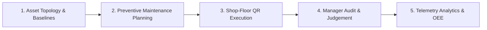

# EAMO — Equipment Asset Management Solution

**Enterprise-Grade Industrial Asset Management & Maintenance Operations System**

 

---

## Overview

**EAMO (Equipment Asset Management Solution)** is an enterprise-grade industrial asset management and maintenance operations platform engineered for modern manufacturing plants, production facilities, and industrial workshops.

The platform establishes an end-to-end digital lifecycle across all plant machinery: from visual hierarchical topology mapping and camera-native shop-floor QR inspections to preventive maintenance scheduling, real-time operating parameter telemetry logging, and machine availability analytics.

---

## Operational Lifecycle & Core Workflow

1. **Asset Topology & Operating Baselines**
   - Establishes a multi-tier physical asset registry: *Plant Area $\rightarrow$ Production Line $\rightarrow$ Machine Cell $\rightarrow$ Sub-Assembly $\rightarrow$ Component*.
   - Configures operational limits (Target, Min, Max), measurement units (`°C`, `bar`, `kW`, `RPM`), and generates dedicated physical machine QR identifiers.

2. **Preventive Maintenance Planning & Scheduling**
   - Automates calendar-driven recurring maintenance intervals (daily, weekly, monthly, quarterly, annual).
   - Coordinates multi-engineer dispatch, replacement part tracking, and centralized work-order visibility on the interactive Workspace Calendar.

3. **Shop-Floor QR Inspection & Checklist Execution**
   - Shop-floor technicians scan physical machine QR badges via handheld devices to immediately hydrate machine context.
   - Rapid execution of scheduled checklist items, analog gauge readings, pass/fail state toggles, and instant breakdown incident reporting with photo capture.

4. **Manager Evaluation & Operational Clearance (Judgement)**
   - Plant managers and reliability engineers review completed inspection rounds and work orders in a centralized review drawer.
   - Evaluates out-of-tolerance readings, authorizes corrective interventions, and provides formal operational release.

5. **Continuous Telemetry & Reliability Analytics**
   - Records time-series machine telemetry data against upper and lower critical threshold boundaries.
   - Automatically computes run hours, idle duration, and unplanned downtime to deliver actionable Availability Factor, MTBF (Mean Time Between Failures), and MTTR (Mean Time To Repair) metrics.

---

## Core Platform Capabilities

* **Dual-Portal Operational Architecture**:
  * **Desktop Web Management Console**: Strategic command center for plant leadership, reliability engineers, and maintenance managers featuring interactive analytics, topology visualizers, and master data control.
  * **Mobile Operator Interface (OI)**: Touch-optimized, camera-native web application tailored for shop-floor technicians operating directly in machine bays.
* **Unified Workspace Calendar**: Consolidated operational calendar harmonizing daily inspection rounds and planned preventive maintenance schedules with color-coded status tracking.
* **Incident Escalation & Root Cause Analysis**: Real-time error classification, technician assignment, dispatch notifications, and root-cause logging upon incident resolution.
* **Granular Role-Based Access Control (RBAC)**: Five-tier organizational governance (*Admin, Manager, Engineer, User/Operator, Guest*) enforcing operational safety boundaries while ensuring strict audit compliance.

---

## Live Production Deployment

The system is deployed and accessible in production at:
* **Production URL**: [**https://eamo.io.vn**](https://eamo.io.vn/)

---

## License & Contact

This project is licensed under the [MIT License](LICENSE).

* **Official Website**: [https://eamo.io.vn](https://eamo.io.vn)
* **Author / Contact**: [khanhnd05@gmail.com](mailto:khanhnd05@gmail.com)

&copy; 2026 EAMO. Equipment Asset Management Solution. All rights reserved.
