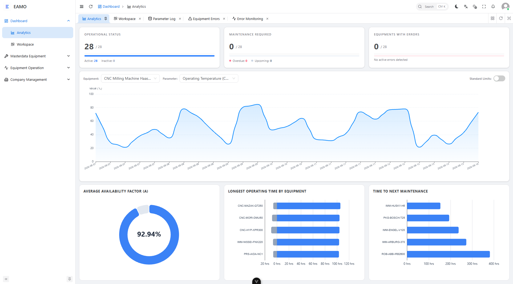
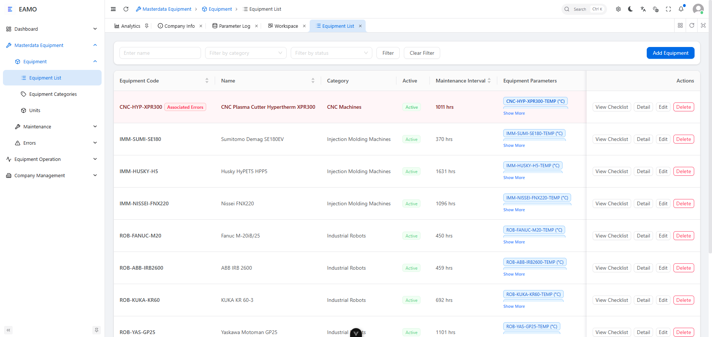
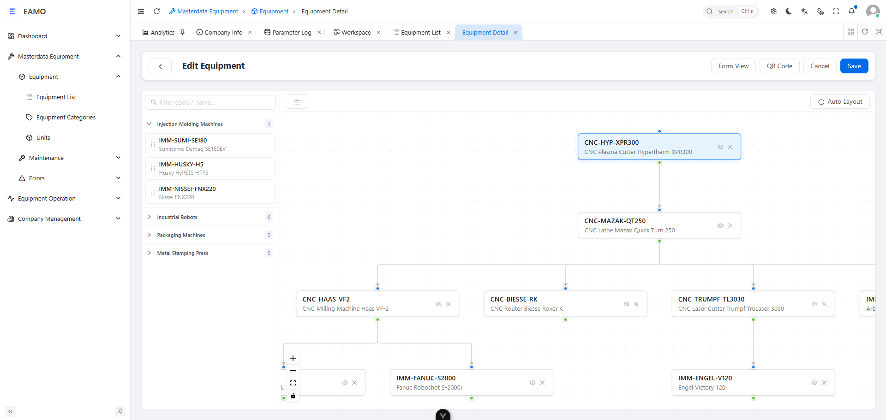
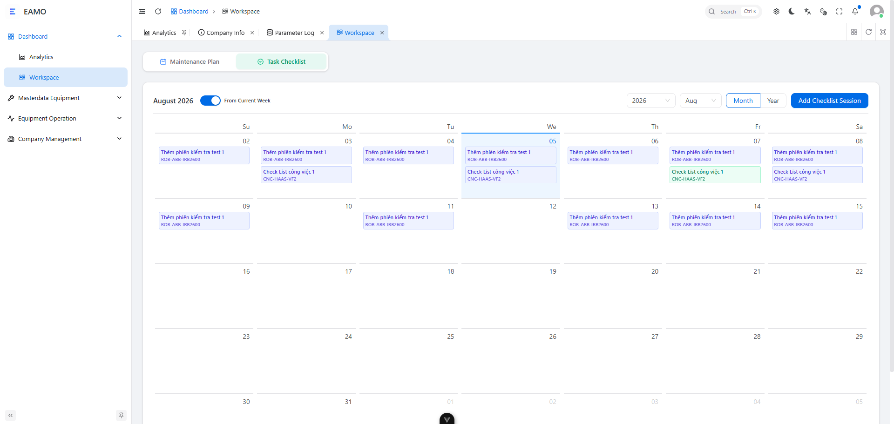
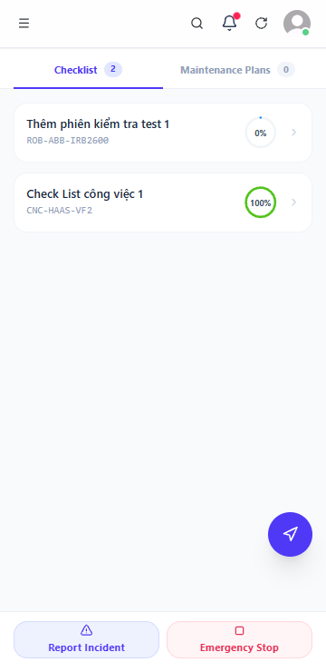
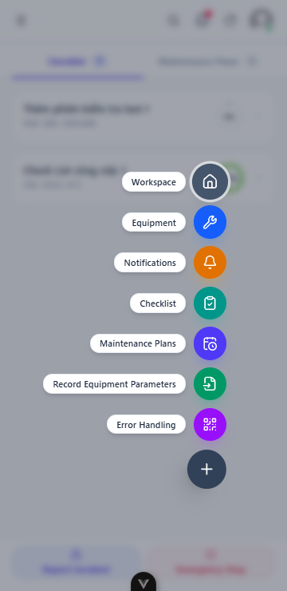
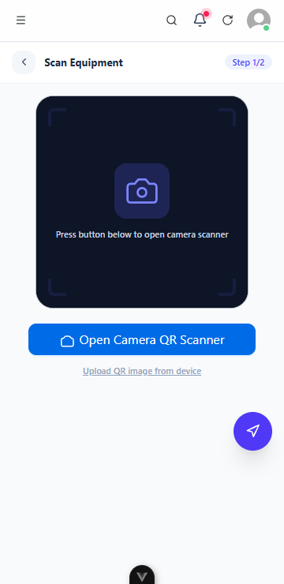
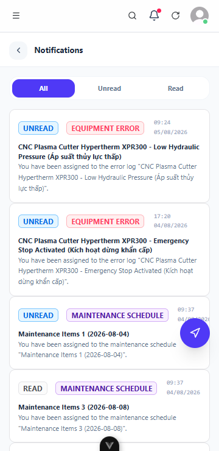

# EAMO — Equipment Asset Management Solution

---

## Repositories

| <nobr>Repository</nobr> | Description |
| :--- | :--- |
| <nobr>[eamo-frontend](https://github.com/eamo-mes/eamo-frontend)</nobr> | Frontend application for the EAMO project. Built using Vue 3, Vite, TypeScript, and the Ant Design Vue components library, managed as a pnpm monorepo. Integrates authentication using OAuth 2.0 PKCE with Laravel Passport. |
| <nobr>[eamo-backend](https://github.com/eamo-mes/eamo-backend)</nobr> | Backend API server and OAuth 2.0 PKCE authentication server for the EAMO platform. Built using Laravel 13, PostgreSQL, and Laravel Passport. |
| <nobr>[eam-mes-package](https://github.com/LavioDev/eam-mes-package)</nobr> | Core shared Composer package providing service providers and migrations to integrate Checklist, Maintenance, Parameter Logs, and Error Monitoring into Laravel EAM MES applications, along with a Dynamic Table Extension system. |

---

## Overview

EAMO (Equipment Asset Management Solution) is an enterprise-grade industrial asset management and maintenance operations system built for manufacturing plants and production facilities. The platform provides end-to-end coverage across the full equipment lifecycle: from master data configuration and daily inspection routines through preventive maintenance scheduling, real-time parameter telemetry logging, and live breakdown incident management.

The system is composed of two primary interfaces: a desktop Web Management Console for administrative, managerial, and engineering staff, and a Mobile Operator Interface (OI) purpose-built for shop-floor technicians operating handheld devices on the factory floor.

---

## System User Interfaces

### Desktop Web Management Console

The desktop portal delivers comprehensive dashboards, analytical charts, asset hierarchy browsing, and full CRUD management for all platform resources. It targets Managers, Engineers, and Administrators.

<div align="center">
  <p><b>Executive Dashboard — Real-Time Equipment Status & Monitoring</b></p>
  
</div>

<br/>

<div align="center">
  <p><b>Equipment Master Data List — Asset Hierarchy & Category Management</b></p>
  
</div>

<br/>

<div align="center">
  <p><b>Equipment Detail View — Parameters, Error Definitions & State Configuration</b></p>
  
</div>

<br/>

<div align="center">
  <p><b>Workspace View — Operational Layout & Multi-department Overview</b></p>
  
</div>

---

## Mobile Operator Interface (OI)

The Operator Interface is a mobile-first web portal designed specifically for shop-floor technicians, operators, and maintenance engineers using handheld devices or ruggedized industrial tablets at the machine level.

The OI is accessed via a dedicated portal route and implements a 2-step QR-scan workflow across its core functions: the operator scans a physical equipment QR code attached to the machine, which hydrates the system context for that specific asset, then proceeds to complete the relevant data entry action.

Key design characteristics of the OI:

- **Camera-native QR scanning**: Uses a real-time HTML5 video camera stream to decode equipment QR codes directly, with fallback matching against master data if the equipment is not recognized.
- **Mobile-first single-page interaction**: Minimal taps, large touch targets, and a chip/card-based selection interface instead of dropdown menus.
- **Non-empty field filtering**: For parameter logging, client-side logic automatically strips blank fields from the submission payload, preventing empty database records without requiring manual validation by the operator.
- **Bilingual support**: The interface supports both English and Vietnamese localization.

### Mobile OI Screenshots

<div align="center">
  <div style="display: flex; overflow-x: auto; gap: 16px; padding: 12px 0; -webkit-overflow-scrolling: touch; justify-content: flex-start;">
    
    
    
    
  </div>
</div>

For full architectural specifications, sequence diagrams, and API payload schemas, refer to the [Operator Interface Technical Documentation Master Index](../docs/oi/README.md).

---

## Core Platform Features

### Equipment & Master Data Management

The system maintains a structured asset registry with support for hierarchical parent-child equipment relationships, allowing plant assets to be organized by production line, machine group, or sub-component. Each equipment record includes category classification, state definitions (e.g., Running, Fault, Idle, Under Maintenance), pre-configured error definitions, and technical parameter specifications with upper and lower operating limits. QR code generation and decoding are built in for rapid physical identification from mobile devices.

### Daily Checklist Inspections

The checklist module supports the creation of daily inspection sessions, defining which equipment items are to be inspected and by which operators. Engineers complete scheduled inspections by recording values against each checklist item. Completed sessions are evaluated (judged) by Managers, who verify whether recorded values fall within safe operating ranges. Full audit trails are maintained with inspector identity, timestamps, and completion status.

### Preventive & Corrective Maintenance

The maintenance module enables Managers to define structured maintenance plans tied to specific equipment, specifying recurrence intervals (daily, weekly, monthly, annually), assigned responsible engineers, required maintenance items and categories, and target dates. The system generates maintenance schedules from these plans, which Engineers execute and mark as completed. All completed maintenance activities are recorded in maintenance logs capturing work performed, components replaced, and labor details.

### Error Monitoring & Telemetry Analytics

The error monitoring module consolidates machine breakdown incident tracking and operational uptime data. Incident logs record the specific error that occurred, the time of occurrence, resolution details, the handling technician, and whether the incident has been resolved. Operating time records capture run hours, idle time, and downtime periods per equipment, supporting OEE and MTBF calculations. The parameter log module stores historical telemetry readings against each configured parameter, enabling trend analysis and anomaly detection over time.

---

## Role-Based Access Control

EAMO implements a hierarchical access control system with four roles. Access to API endpoints is enforced at the middleware level; each role inherits all permissions of lower-ranked roles.

| Role | Hierarchy Level | Scope of Access |
| :--- | :---: | :--- |
| Admin | 4 | Full system administration: manage companies, departments, global user accounts, and all system resources. |
| Manager | 3 | Operations management: create and edit equipment master data, define maintenance plans, approve checklist session judgements, manage error logs, and import telemetry data in bulk. |
| Engineer | 2 | Technical execution: view all equipment records, perform checklist inspections, execute assigned maintenance work orders, log equipment telemetry parameters, and submit breakdown incident reports. |
| User | 1 | Basic access: view personal schedule assignments, manage own profile, and receive system notifications. |

---

## System Architecture & Technology Stack

| Layer | Technology |
| :--- | :--- |
| Backend Framework | Laravel 13 / PHP 8.4 — Modular architecture with Single Action Controllers (ADR pattern) — [eamo-backend](https://github.com/eamo-mes/eamo-backend) |
| Core Package | [eam-mes-package](https://github.com/LavioDev/eam-mes-package) — Service providers, migrations, and a Dynamic Table Extension system to integrate Checklist, Maintenance, Parameter Logs, and Error Monitoring |
| Authentication | Laravel Passport — OAuth 2.0 PKCE authentication with custom role middleware (`engineer`, `manager`, `admin`) |
| Frontend Portal | Vue 3 with TypeScript, Vite, and Ant Design Vue components library (pnpm monorepo) — [eamo-frontend](https://github.com/eamo-mes/eamo-frontend) |
| Mobile OI Portal | Mobile-first responsive web application with HTML5 Camera Stream QR scanning |
| Database | PostgreSQL with UUID primary keys |
| Module Structure | Domain-driven modular layout: `Masterdata/Equipment`, `Equipment/Checklist`, `Equipment/Maintenance`, `Equipment/ErrorMonitoring`, `Equipment/ParameterLog` |

---

## Getting Started

### 1. Install the Core Package

Add the repository and requirement to your backend `composer.json`:

```json
{
    "repositories": [
        {
            "type": "vcs",
            "url": "https://github.com/LavioDev/eam-mes-package"
        }
    ],
    "require": {
        "laviodev/eam-mes-package": "dev-main"
    }
}
```

Then run:

```bash
composer update laviodev/eam-mes-package
```

Publish the config file and copy the submodule code files:

```bash
# Publish config/eam.php to your application
php artisan vendor:publish --tag="eam-mes-package-config"

# Publish all modules and submodules at once (including core models, actions, and routes)
php artisan eam-mes:publish --all
```

### 2. Backend — [eamo-backend](https://github.com/eamo-mes/eamo-backend)

Configure your `.env` file to use PostgreSQL:

```ini
DB_CONNECTION=pgsql
DB_HOST=127.0.0.1
DB_PORT=5432
DB_DATABASE=eam
DB_USERNAME=postgres
DB_PASSWORD=your_postgres_password
```

Run installation steps:

```bash
cd backend
composer install
cp .env.example .env
php artisan key:generate
php artisan migrate:fresh --seed
php artisan passport:keys --force
php artisan passport:client --public --name="Eamo Frontend" --redirect_uri="http://localhost:5173/auth/callback" --no-interaction
php artisan storage:link
npm install
npm run build
php artisan serve
```

*Note: Copy the generated Public Client ID from `oauth_clients` to the frontend `.env` file (`VITE_AUTH_CLIENT_ID`).*

### 3. Frontend — [eamo-frontend](https://github.com/eamo-mes/eamo-frontend)

Requires Node.js >= 18 and Pnpm >= 9.

```bash
cd frontend
cp .env.example .env
# Configure VITE_AUTH_CLIENT_ID in .env
pnpm setup
pnpm dev
```

---

&copy; 2026 EAMO. Equipment Asset Management Solution.
